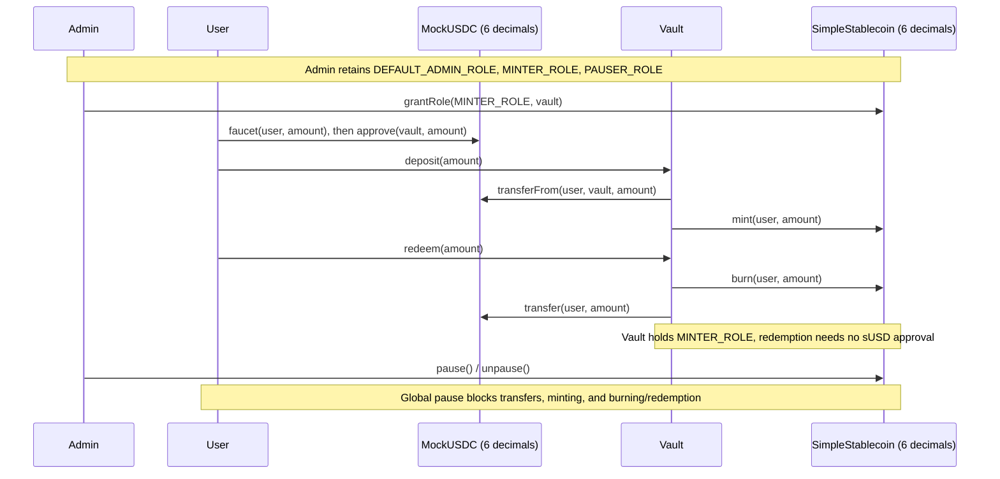
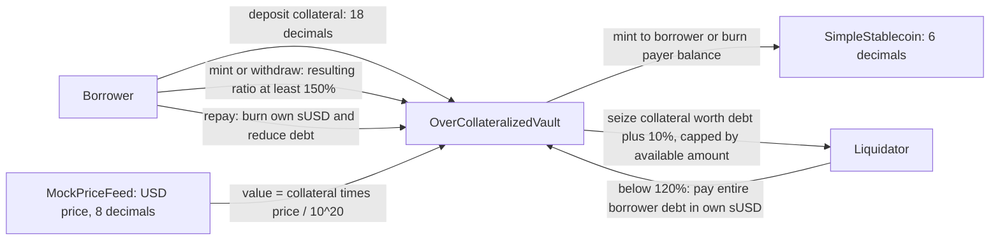

# COMP7810 Stablecoin Lab — WangCongjie 3036099368

Submission repository: [GGGG216/COMP7810_WangCongjie_3036099368_Lab](https://github.com/GGGG216/COMP7810_WangCongjie_3036099368_Lab).

**Latest Assignment Two format:** upload **one project ZIP, including `lib/`, to Moodle** by **16 October 2026, 23:55**, and paste all three verified Sepolia addresses and Etherscan links into Moodle's text box. GitHub is a supporting copy. Sepolia is graded at **20%**; Ex7 is optional and unmarked. See [SUBMISSION.md](SUBMISSION.md) for the requirement mapping, packaging command, and remaining steps.

Completed from [hgwoops/stablecoin-lab-2026](https://github.com/hgwoops/stablecoin-lab-2026), upstream commit [`971ae77107f750153208c495bb000673c9560403`](https://github.com/hgwoops/stablecoin-lab-2026/tree/971ae77107f750153208c495bb000673c9560403). This lab demonstrates collateral accounting, mint/redeem permissions, liquidation, and the limits of a stablecoin's backing invariant.

**Ex0–Ex6 and the optional Ex7 challenge are complete.** The full Foundry run reports **44 passed, 0 failed, 0 skipped across 6 suites**. Both invariant properties passed in a grouped invariant result: 256 runs at depth 500, totaling 128,000 handler calls with zero reverts. The recorded deployment uses local Anvil. **Tier 2 Sepolia deployment and Etherscan verification are pending:** a test-ETH-funded wallet and verification credentials have not yet been configured. This pending item is listed separately so local evidence is not mistaken for testnet deployment evidence.

## Run on Windows

Run these commands in PowerShell from this directory:

```powershell
.\scripts\setup-windows.ps1
.\scripts\lab.ps1 doctor
.\scripts\lab.ps1 test
.\scripts\lab.ps1 demo
```

The setup script downloads official **Foundry v1.8.4 for Windows amd64** and **Solidity 0.8.24**, verifies download checksums, and installs them under the ignored `.tools/` directory. OpenZeppelin v5.0.2 and `forge-std` are bundled in `lib/`. No global PATH change or administrator installation is needed; the task runner restores its temporary environment changes on exit.

| Task | Command | Purpose |
|---|---|---|
| Environment | `.\scripts\lab.ps1 doctor` | Check tools, bundled dependencies, and core tests |
| Core checkpoint | `.\scripts\lab.ps1 core` | Run the 7 original core tests |
| All tests | `.\scripts\lab.ps1 test` | Run core, exercises, edge cases, and challenge |
| Required exercises | `.\scripts\lab.ps1 exercise` | Run the exercise suites |
| Optional Ex7 | `.\scripts\lab.ps1 challenge` | Run the Unstoppable solution |
| Formatting | `.\scripts\lab.ps1 fmt` | Check formatting of the completed exercise files without changing them |
| CLI demonstration | `.\scripts\lab.ps1 demo` | Deploy and perform Ex1/Ex3 on a fresh local Anvil |
| Tier 2 | `.\scripts\lab.ps1 sepolia` | Deploy to Sepolia and verify all three contracts after credentials are configured |

The demo binds Anvil to `127.0.0.1:18545`, refuses to reuse an occupied port, and stops its own node afterward. It creates two temporary random accounts in memory, funds them only on its local Anvil instance, and writes public transaction receipts and balance snapshots to `evidence/`. No private-key literal or seed phrase is stored in the submitted scripts. For the manual Makefile deployment, supply `ANVIL_KEY` through your local shell environment.

The original Bash/Make workflow remains available on Linux, macOS, WSL, or Codespaces with Foundry installed:

```bash
make doctor
make test       # core checkpoint only
make exercise
make challenge
forge test -vv  # all suites
```

See [EXERCISES.md](EXERCISES.md) for the original task descriptions and individual CLI commands.

## Tier 2 — Sepolia deployment and verification (pending credentials)

Fill `PRIVATE_KEY`, `SEPOLIA_RPC_URL`, and `ETHERSCAN_API_KEY` in the ignored local `.env` file, using [.env.example](.env.example) as the template. The wallet must contain Sepolia test ETH. Keep the private key and API key out of the repository and screenshots.

```powershell
.\scripts\lab.ps1 sepolia
```

The helper checks for Ethereum Sepolia chain ID `11155111`, rejects zero and known default Anvil fixture keys, deploys the three contracts and grants the vault its minting role, then verifies their source on Etherscan. It writes public addresses, transaction hashes, verification outcomes, and explorer links to `evidence/sepolia.json`. If deployment succeeded but verification failed, retry without deploying again:

```powershell
.\scripts\deploy-sepolia.ps1 -Mode VerifyOnly
```

Existing deployment records prevent accidental redeployment. An interrupted or partial broadcast must be inspected and resumed separately. The helper's syntax and credential rejection were checked locally; live Sepolia deployment and verification have **not** been executed. Once they succeed, add the generated public evidence and update this pending status before the final course submission.

## Architecture

The fiat loop uses six decimals for both collateral (`MockUSDC`) and stablecoin (`SimpleStablecoin`). A successful deposit increases collateral and supply by the same amount; redemption burns the caller's sUSD and returns the same quantity of collateral.

Portable text diagram (also readable without a Mermaid renderer):

```text
User -- approve collateral --> MockUSDC (6 decimals)
User -- deposit(amount) ----> Vault -- transferFrom(user) --> MockUSDC
                              |
                              +-- mint(user, amount) -----> SimpleStablecoin
User -- redeem(amount) -----> Vault -- burn(user, amount) -> SimpleStablecoin
                              +-- return collateral ------> User

Admin -- grant/revoke MINTER_ROLE --> SimpleStablecoin <-- MINTER_ROLE -- Vault
Admin -- pause/unpause ------------> SimpleStablecoin (transfers/mint/burn)
```



The over-collateralized exercise is a **separate deployment/test fixture**, not another collateral pool connected by `Deploy.s.sol`. It tracks each borrower's deposited collateral and debt. Its own vault must receive `MINTER_ROLE` on its stablecoin instance.



Valuation uses `Math.mulDiv` and rounds down to six-decimal dollar units. Minting and withdrawals enforce the post-operation 150% minimum. Liquidation is allowed strictly below 120%, clears the target's debt, burns the liquidator's sUSD, and caps the collateral payout. Deeply underwater positions may lack willing liquidators because the caller must still pay the full debt.

## Completed exercises

| Exercise | Implementation and evidence |
|---|---|
| Ex0 — environment | Project-local Windows toolchain; [doctor log](evidence/doctor.txt); 7 core tests passing |
| Ex1 — mint/redeem loop | Actual local deployment, faucet, approval, deposit, and redemption; [CLI transcript](evidence/ex1-ex3.txt) and [transaction receipts](evidence/ex1-ex3.json) |
| Ex2 — decimals | Fuzzed supply accounting and the `1000e18` trap in [01_LoopTasks.t.sol](test/exercises/01_LoopTasks.t.sol): six-decimal units make this **10^15 tokens**, not 1,000 |
| Ex3 — broken backing | Unauthorized mint reverts; role grant enables unbacked mint; [evidence screenshot](evidence/ex3.png) |
| Ex4 — permissions/pause | All five specified cases implemented, including the vault's token-level burn authority |
| Ex5 — collateral/liquidation | Four required methods completed in [OverCollateralizedVault.sol](src/exercises/OverCollateralizedVault.sol), with additional boundary, rounding, rollback, and liquidation tests |
| Ex6 — invariants | Bounded redemption handler and two invariant properties in [02_InvariantTasks.t.sol](test/exercises/02_InvariantTasks.t.sol); deterministic handler coverage also included |
| Ex7 — optional challenge | Direct collateral donation breaks the challenge vault's balance/share assumption and stops flash loans; [solution](test/challenges/Unstoppable.t.sol) |
| Discussion | All A1–D2 answers, test names, and an additional proposed attack scenario in [STUDENT-QUESTIONS.md](STUDENT-QUESTIONS.md) |

## Recorded results

The local CLI demonstration produced these balances, in six-decimal base units:

| Stage | sUSD total supply | Vault collateral |
|---|---:|---:|
| Deposit 1,000 mUSDC | 1,000,000,000 | 1,000,000,000 |
| Redeem 250 sUSD | 750,000,000 | 750,000,000 |
| Attacker mints 1,000,000 sUSD after receiving its role | 1,000,750,000,000 | 750,000,000 |

The last row demonstrates **1,000,000 unbacked tokens**. It measures broken backing; no secondary-market price was measured.

- [Full Foundry output](evidence/forge-test.txt): 44 passed, 0 failed, 0 skipped across 6 suites.
- [Environment check](evidence/doctor.txt) and [deployment output](evidence/deployment.txt).
- [Ex1/Ex3 transcript](evidence/ex1-ex3.txt) and [JSON transaction receipts and snapshots](evidence/ex1-ex3.json).
- [Passing-tests screenshot](evidence/tests.png) and [Ex3 screenshot](evidence/ex3.png).
- [Local evidence report](evidence/index.html): the screenshots render actual saved logs; they are labeled as evidence-report renderings, rather than terminal captures.

To refresh the saved logs and HTML report after changes, run the following from this directory (Python is only needed for the report generator):

```powershell
.\scripts\lab.ps1 test | Tee-Object -FilePath evidence\forge-test.txt
.\scripts\lab.ps1 doctor | Tee-Object -FilePath evidence\doctor.txt
.\scripts\lab.ps1 demo
python scripts\build-evidence.py
```

The PNG files capture the recorded run; recapture them from the refreshed report if the results change.

## Scope and deliberate limitations

This is an educational implementation. The administrator retains minter authority after deployment. `MockUSDC` has an unrestricted faucet; the mock price feed is permissionless and has no meaningful staleness protection. The token's global pause also blocks redemption. `MINTER_ROLE` authorizes burning any holder's balance at the token boundary, although the current fiat vault's public redemption function only burns its caller's balance. The discussion answers propose safer alternatives; these behaviors remain visible for the required exercises.

The invariant campaign targets only the handler's legitimate deposits and redemptions. It checks `totalCollateral() == totalSupply()` and that the vault holds no sUSD **within that action model**. It excludes direct transfers, donations, arbitrary privileged mint/burn calls, and pauses. A collateral donation can make backing greater than supply without causing insolvency; an external sUSD transfer can give the vault a balance. Thus these test properties are not unrestricted guarantees about every possible transaction.

Equal token quantities also do not prove dollar value, immediate redeemability, or a market peg. Collateral quality, accessible liquidity, permissions, and off-chain claims matter. No production security claim or testnet verification is implied by passing these local tests.
